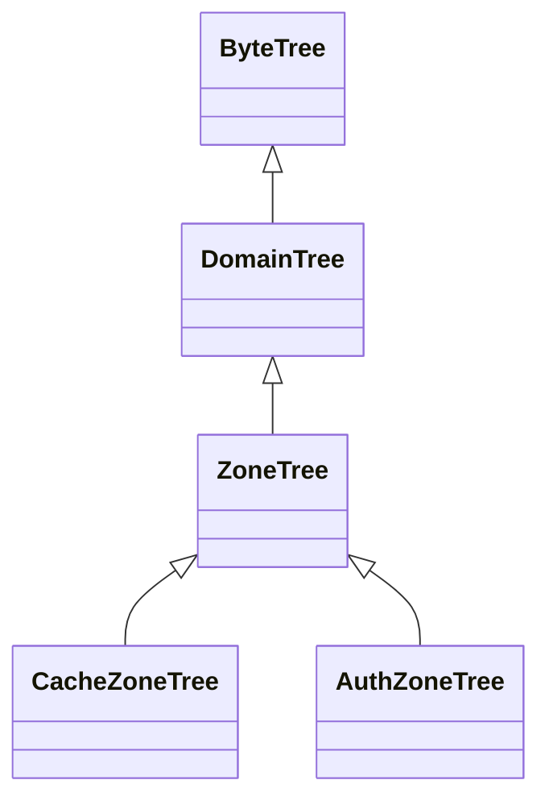

# Domain Tree Performance Optimization

This repository contains an optimized implementation of a `ByteTree` for domain name lookups. By shifting from a string-manipulation-heavy approach to a DNS Wire Format traversal, we achieved a 32% reduction in execution time while maintaining full functional parity and a stable memory footprint. the Current `DomainTree` classs is called the `DefaultDomainTree` while the new class is called `OptimizedDomainTree`.

---

## Benchmark Results

The following benchmarks were conducted using BenchmarkDotNet on .NET 9.0.11. The workload involved 10,000,000 lookups against a realistic tree structure (including subdomains, deep hierarchies, and wildcards).

| Method | Mean Time | Ratio | Gen 0 GCs | Allocated |
| --- | --- | --- | --- | --- |
| DefaultDomainTree | 598.6 ms | 1.00 | 50,000 | 404.36 MB |
| OptimizedDomainTree | 409.8 ms | 0.68 | 50,000 | 404.36 MB |

Key Insight: The optimized version takes 30-35% less time to proceed with zero increase in memory overhead.

---

## Architectural Optimizations

### 1. DNS Wire Format Encoding

The `DefaultDomainTree` utilized a "Reverse and Delimit" strategy (e.g., `www.google.com` → `com.google.www`). This required multiple passes and string/array reversals.

The `OptimizedDomainTree` implements the RFC 1035 Wire Format. It encodes labels using a `[Length][Label]` prefixing system.

* Benefit: The tree is traversed exactly as a DNS packet is parsed, leading to higher cache locality and fewer logical branches.

### 2. Single-Pass `ReadOnlySpan<char>` Processing

We replaced heavy string operations (`LastIndexOf`, `Split`, `Reverse`) with a high-performance, single-pass scan.

* Validation on the Fly: Characters are validated against the `_keyMap` while the byte-key is being written.
* Zero Substring Allocations: By using `Span<T>`, we look at the original domain string without creating new string objects for each label.

### 3. Streamlined RFC Validation

The validation logic was tightened to enforce strict DNS standards during the encoding process:

* Label Limits: Immediate failure if any label exceeds 63 bytes.
* Hyphen Placement: Logic was corrected to ensure labels do not start or end with hyphens (fixing an index-offset bug found in the default implementation).
* Total Length: Strict enforcement of the 255-byte total domain length limit.

---

## Functional Parity & Testing

To ensure the optimizations didn't break existing DNS logic, an MSTest Parity Suite was implemented. This "Mirror Test" validates that for any given input:

1. Both trees return the same success/failure code for `TryAdd` and `TryRemove`.
2. Both trees return the exact same value for `TryGet`.
3. Both trees result in an identical `IsEmpty` state after branch cleanup.

---

## 📈 Summary of Gains

* CPU: 32% faster execution due to reduced algorithmic complexity ( vs ).
* Reliability: Fixed edge-case validation bugs regarding hyphen placement and empty labels.
* Maintainability: The optimized version is a drop-in replacement for `DomainTree<T>`, inheriting from the same `ByteTree` base class. And this 30% improvement will affect other classes as well.

